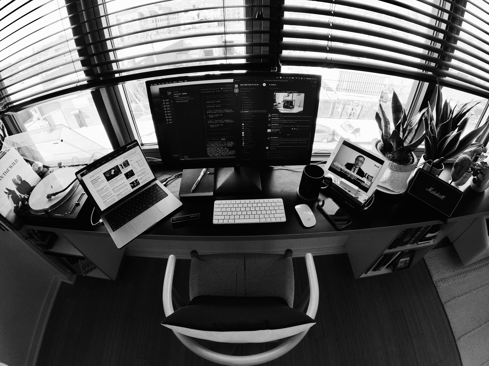

# This is my personal repository, it is the first thing that I created when I started the FinTech boot camp. 

*March 30, 2022* It has been almost a month since when I started the course and I have learned a lot. I love everything about the FinTech boot camp, and my instructor is great!
It is a fast environment and I have to be very very focussed, I am trying my best I hope this will lead me to a good job in Data Analysis. 

Here is a picture of my workstation:
>
